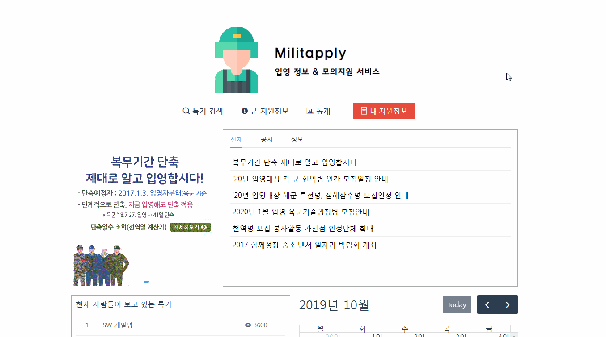
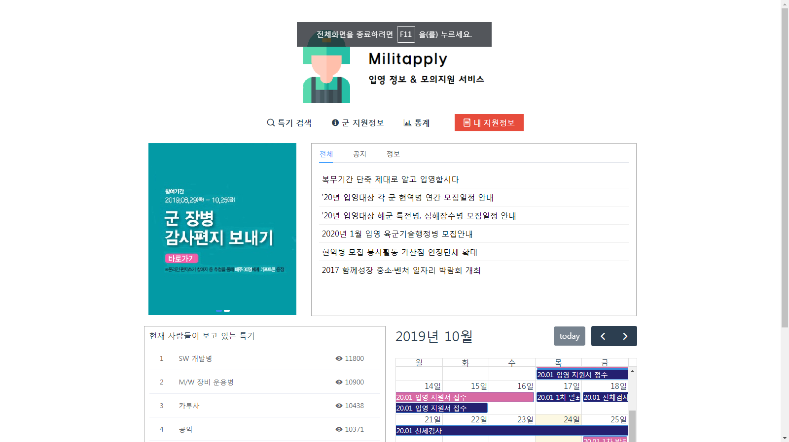
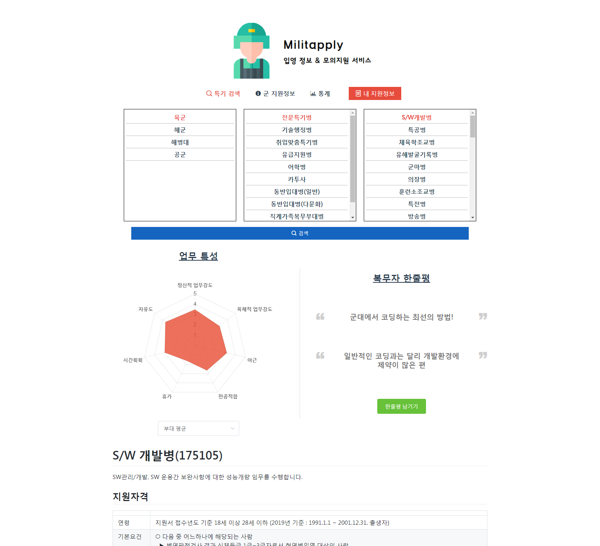
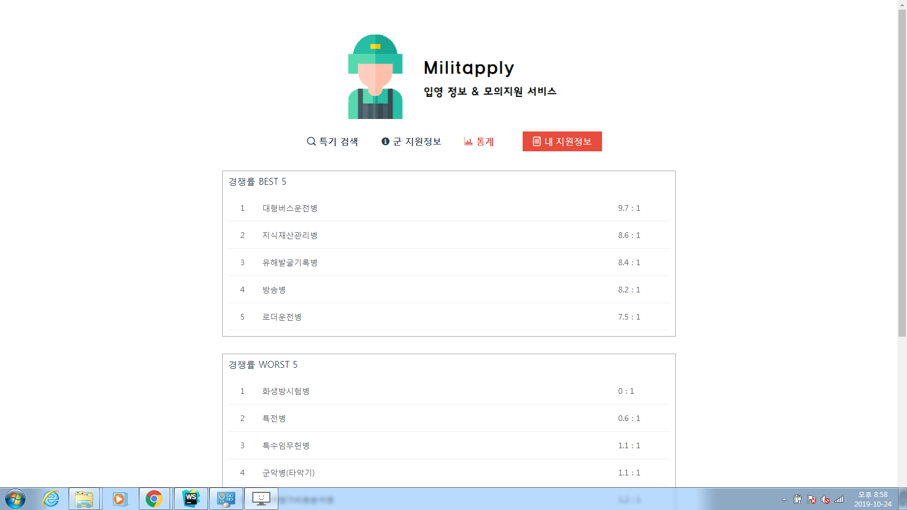
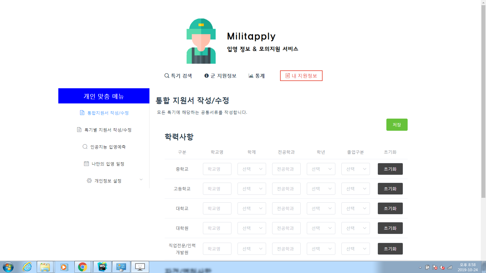
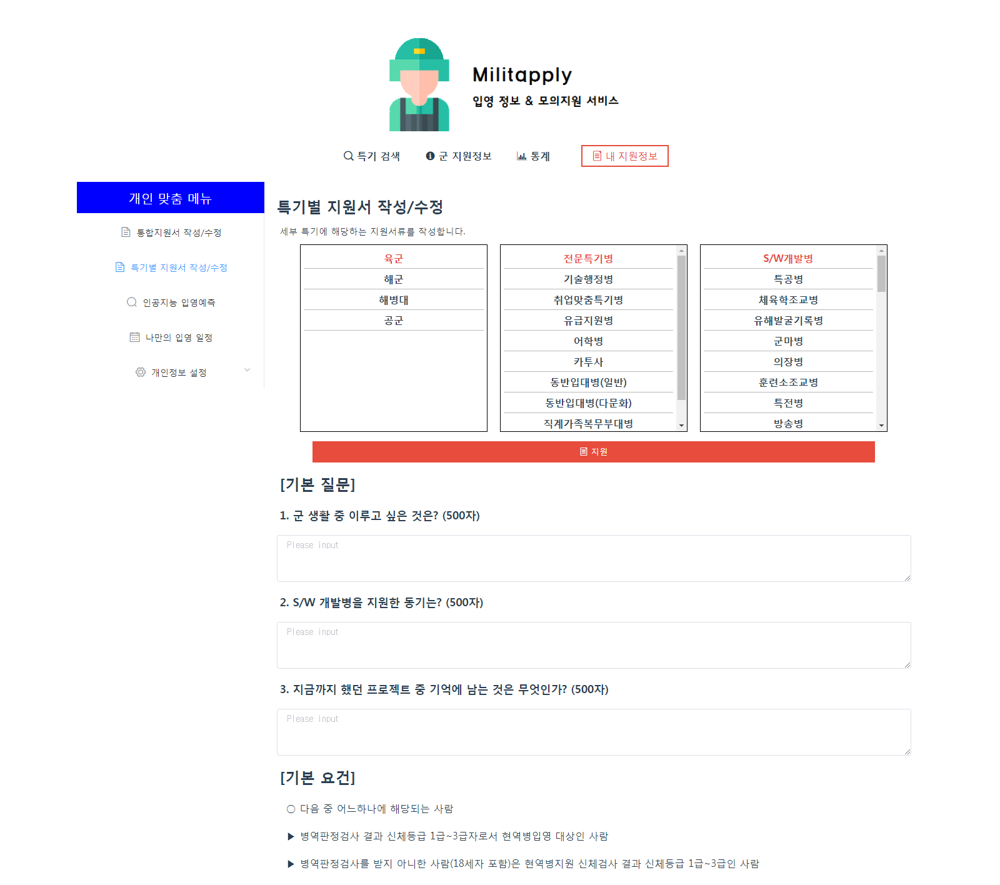

# 
> 2019 OSAM(Open Source Academy for Military) 출품작



## 실행 환경
- CPU : Intel i7-6700HQ 2.60GHz
- RAM : 8GB
- OS : Windows 7
- Browser : Chrome 77.0.3865.120
- Node.js : v10.16.3
- NPM : v6.9.0

## 실행
> 실행을 위해서는 Node.js와 git이 설치되어 있어야 합니다
1. 저장소 클론
```
git clone https://github.com/identity16/dr-mili.git
```
2. 폴더 이동
```
cd dr-mili
```
3. Dependency 설치
```
npm install
```
4. [json-server](https://github.com/typicode/json-server)으로 된 Mock DB 실행 (데모용 데이터가 들어가있음)
```
npm run mockdb
```
5. vue 프로젝트 실행
```
npm run serve
```
> 본 프로젝트는 프로토타입이므로 개발 모드로 실행됩니다.
6. 사이트 접속

브라우저에서 [https://localhost:8080](https://localhost:8080)에 접속합니다

## 기능 안내

### 대시보드

다양한 군 관련 정보와 현재 사람들이 보고있는 특기, 입영 관련 일정 등의 정보를 제공하는 화면



### 특기 검색

병무청에서 제공하는 기본적인 정보 뿐만 아니라 현역 또는 전역자가 본인의 특기를 다양한 방면에서 평가한 정보를 열람(누구나) / 수정(현역, 전역 인증 시)할 수 있는 화면(현재는 육군 > 전문특기병 > S/W 개발병에 대한 데이터가 데모용으로 존재)



### 통계

특기 정보, 사용자 행동 패턴 등의 데이터를 모아 입영 지원에 도움될 만한 여러가지 통계를 보여주는 화면. 현재는 경쟁률 BEST / WORST, 조회 수만 있지만 다양한 확장 가능



### 나의 지원정보

통합 지원서, 특기별 지원서 등의 실제 지원과 관련된 데이터들을 미리 작성해 볼 수 있는 화면. 이 뿐만 아니라 작성 내용을 토대로 인공지능 API를 이용해 더 나은 방향으로 작성하도록 유도하거나 확률 예측 등의 기능도 제공함.

#### 통합 지원서 작성/수정



#### 특기별 지원서 작성/수정


